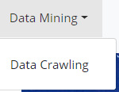

# Jobinfo_Spider

简介：基于 python 的就业数据挖掘与分析爬虫，输入职位、所需爬取的页数进行爬取，进行数据清洗后存入数据库，输入城市、招聘时间区间进行过滤，有数据分页查看、图表化展示、后台数据管理等功能。

## 使用方法

将项目克隆到本地后，在 MySQL 中创建 pythondb 数据库，将项目中的 pythondb.sql 导入 pythondb 数据库。

在项目目录下新建终端，输入:

    python manage.py runserver localhost:8080

## 项目展示

### 登录界面

访问 [localhost:8080](127.0.0.1:8080)

输入帐号密码

菜单栏样式如下

如果账户为 root，也可以看到右上角欢迎界面显示出用户名

以及登出按钮

### 数据爬取

点击数据爬取按钮

输入需要的信息

即可在数据库中看到爬取成功

### 数据展示

点击数据展示按钮，在网站中效果如下（带分页按钮）

### 数据可视化

点击数据可视化按钮，输入相关信息

数据可视化展示如下：

### 后台管理

以添加数据为例

在数据库中查看，显示添加成功

